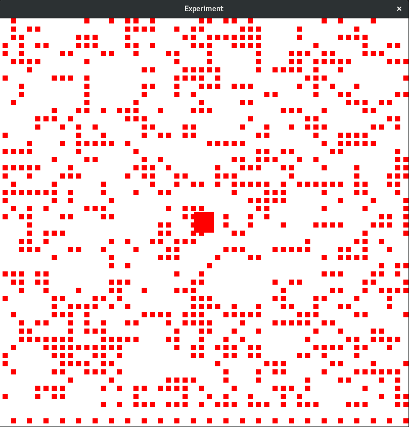

# ConwaysGameOfLife
An implementation of Conway's game of life in Rust using glium

The square in the middle can be moved using the arrow keys but I'd recommand disabling the cells otherwise you get about 1 fps.

## You should know
This is mostly an experimentation with the amazing glium OpenGL wrapper by Tomaka and also the first thing I made in Rust. The actual "Conway's game of life" part shows strange behavior but the real goal was to draw stuff on a frame and it works.
